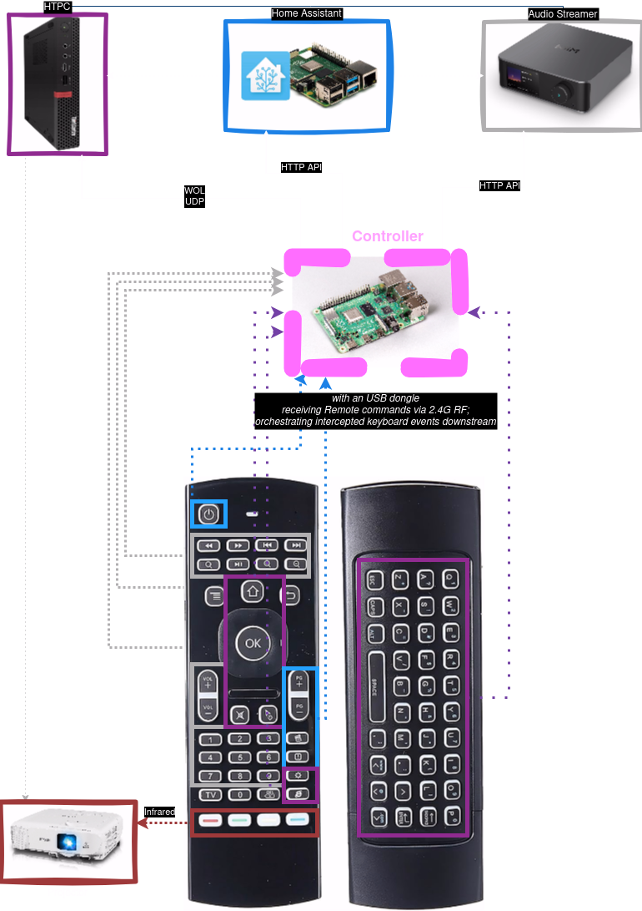

# Interception Controller

_One remote to rule them all._

To replace multiple remote controllers, I came to this solution, where the remote is
connected to a single computer via its USB dongle, and that machine orchestrates
commands to other devices in the network.

This repository contains code to intercept and grab all events coming through the
remote, and issue various commands to other devices on the network.

It is based on Interception Tools, and should be simple to attach various Adapters
for any device that should be controlled.

Except HTTP API for specific devices, I issue WakeOnLan for my HTPC running Steam,
Jellyfin, etc. The PC runs Garuda (Arch-based) linux, so it is also useful to be
able to pass the keyboard keys to the PC. This is done through netcat piping
intercepted keycodes via UDP.

